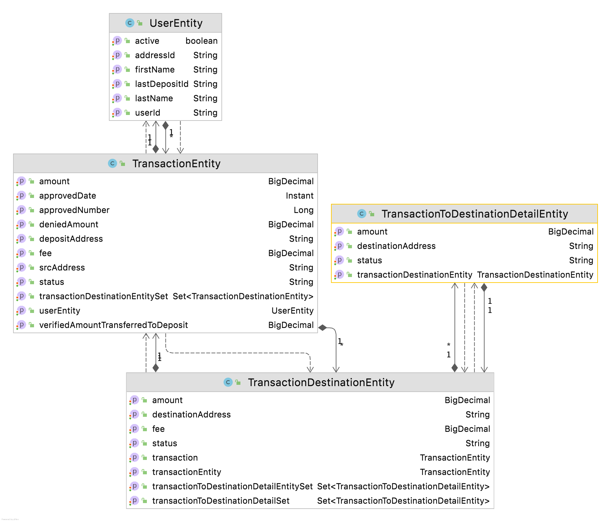

This is a coin mixer, it is one way to maintain your privacy on the crypto network.

It completes the below steps:

1. You provide a list of new, unused addresses that you own to the mixer;
2. The mixer provides you with a new deposit address that it owns;
3. You transfer your bitcoins to that address;
4. The mixer will detect your transfer by watching or polling the P2P Bitcoin network;
5. The mixer will transfer your bitcoin from the deposit address into a big “house account” along with all the other bitcoin currently being mixed; and
Then, 
6. over some time the mixer will use the house account to dole out your bitcoin in smaller discrete increments to the withdrawal addresses that you provided, possibly after deducting a fee.

##Notes
#Controller
It has tow Rest controllers. The 'AddressController' is responsible for crating 'DepositAddress' for each user. The 'TeansferController' is a wrapper on top of transfering 3rd party API.
#Entity
Each mix request has transaction row in our DB. For each Destination list we will create an new row in our 'TransactionDestinatil' Table. This table has a FK to Transaction Table. 
At the begining the transation status is INITITATION, then after transfer the amount to Deposit address, the status is changed to ToDeposit. Finally after our mixer transferd coin to the desitination, for each transaction it creates a row in 'TransactionDestinationDetail'. The summation of this ammount should be equal to the amount user transfered to the deoposit. We considered Fee for the transactions. Also a schduld task which is responsible for transfering coin, breaks down the transactin to Random Increments to keep the privacy.
